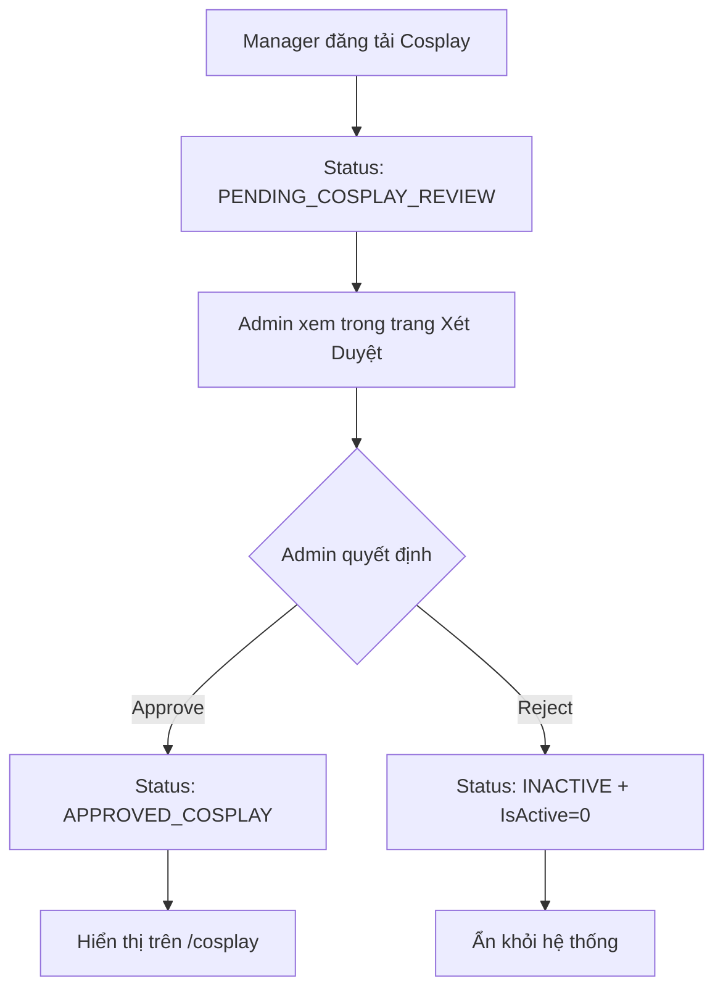

# Admin Cosplay Review Feature

## Tổng Quan
Hệ thống xét duyệt sản phẩm cosplay cho phép Admin kiểm tra và phê duyệt các sản phẩm cosplay được đăng tải bởi Manager trước khi hiển thị công khai trên trang [/cosplay](http://localhost:8080/WearConnect/cosplay).

## Quy Trình Duyệt (Workflow)



## Cấu Trúc Database

### Trạng Thái Sản Phẩm (ClothingStatus)
```sql
ClothingStatus NVARCHAR(50) NOT NULL DEFAULT 'ACTIVE'
```

Các giá trị:
- **ACTIVE**: Sản phẩm thông thường (không phải cosplay) hoặc cosplay được phê duyệt từ trước
- **PENDING_COSPLAY_REVIEW**: Chờ admin xét duyệt (tự động set khi upload cosplay)
- **APPROVED_COSPLAY**: Đã được admin phê duyệt
- **INACTIVE**: Bị từ chối hoặc vô hiệu hóa

## Backend Implementation

### AdminServlet Actions

#### 1. Review Cosplay Page
```java
GET /admin?action=reviewCosplay
```
**Chức năng:**
- Query tất cả Clothing WHERE Category='Cosplay' AND ClothingStatus='PENDING_COSPLAY_REVIEW'
- Load CosplayDetail cho mỗi sản phẩm
- Hiển thị danh sách dạng card với thông tin chi tiết

**Method:** `showCosplayReviewPage()`

#### 2. Approve Cosplay
```java
POST /admin
action=approveCosplay
id={clothingID}
```
**Chức năng:**
- UPDATE Clothing SET ClothingStatus = 'APPROVED_COSPLAY' WHERE ClothingID = ?
- Redirect về review page với success message
- Sản phẩm ngay lập tức hiển thị trên /cosplay

**Method:** `approveCosplay()`

#### 3. Reject Cosplay
```java
POST /admin
action=rejectCosplay
id={clothingID}
```
**Chức năng:**
- UPDATE Clothing SET ClothingStatus = 'INACTIVE' WHERE ClothingID = ?
- UPDATE Clothing SET IsActive = 0 WHERE ClothingID = ?
- Redirect về review page với success message
- Sản phẩm bị ẩn hoàn toàn

**Method:** `rejectCosplay()`

### ClothingDAO Methods

#### getCosplayByStatus()
```java
public static List<Clothing> getCosplayByStatus(String status)
```
Trả về danh sách sản phẩm cosplay theo trạng thái.

**SQL:**
```sql
SELECT * FROM Clothing 
WHERE Category = 'Cosplay' 
  AND ClothingStatus = ? 
ORDER BY CreatedAt DESC
```

#### updateClothingStatus()
```java
public static boolean updateClothingStatus(int clothingID, String status)
```
Cập nhật trạng thái sản phẩm.

**SQL:**
```sql
UPDATE Clothing 
SET ClothingStatus = ? 
WHERE ClothingID = ?
```

#### setClothingActive()
```java
public static boolean setClothingActive(int clothingID, boolean isActive)
```
Bật/tắt hiển thị sản phẩm.

**SQL:**
```sql
UPDATE Clothing 
SET IsActive = ? 
WHERE ClothingID = ?
```

## Frontend

### Admin Menu Navigation
File: `web/WEB-INF/jsp/components/header.jsp`

Thêm link vào menu Admin:
```jsp
<li><a href="${pageContext.request.contextPath}/admin?action=reviewCosplay">
    Xét Duyệt Cosplay
</a></li>
```

### Review Page
File: `web/WEB-INF/jsp/admin/review-cosplay.jsp`

**URL:** `/admin?action=reviewCosplay`

**Layout:**
- Header với số lượng pending count
- Grid layout của product cards
- Mỗi card hiển thị:
  - Ảnh sản phẩm
  - Character name
  - Series name
  - Type badge (Anime/Game/Movie)
  - Accuracy level
  - Accessory list
  - Pricing info (hourly/daily/deposit)
  - Quantity
  - Checklist kiểm tra
  - Approve/Reject buttons

**Empty State:**
- Hiển thị khi không có cosplay nào cần duyệt
- Icon check với thông báo "Tất cả đã được xử lý"

**Alert Messages:**
- `?success=approved`: Hiển thị "Đã duyệt thành công"
- `?success=rejected`: Hiển thị "Đã từ chối"
- `?error=true`: Hiển thị lỗi khi không thể xử lý

### Security

**Session Validation:**
```java
// In AdminServlet doGet()
HttpSession session = request.getSession(false);
if (session == null || session.getAttribute("account") == null) {
    response.sendRedirect(request.getContextPath() + "/login");
    return;
}

Account account = (Account) session.getAttribute("account");
if (!"Admin".equals(account.getRole())) {
    response.sendError(HttpServletResponse.SC_FORBIDDEN);
    return;
}
```

## Filter Logic

### DAO Level Filtering
Tất cả các phương thức query công khai đều phải filter:
```sql
WHERE ClothingStatus != 'PENDING_COSPLAY_REVIEW'
```

**Affected Methods:**
- `getAllActiveClothing()`
- `searchByCategory(String category)`
- `searchByStyle(String style)`
- `searchByOccasion(String occasion)`
- `searchByName(String name)`

### CosplayServlet Logic
```sql
WHERE Category = 'Cosplay' 
  AND (ClothingStatus = 'APPROVED_COSPLAY' OR ClothingStatus = 'ACTIVE')
  AND IsActive = 1
```

Điều này đảm bảo:
- Chỉ hiển thị cosplay đã được duyệt
- Hỗ trợ cosplay cũ (ACTIVE status từ trước khi có hệ thống review)
- Không hiển thị sản phẩm bị ẩn

## Testing Workflow

### 1. Upload Cosplay (as Manager)
```
1. Login as Manager
2. Navigate to Upload Clothing
3. Select Category: Cosplay
4. Fill cosplay-specific fields:
   - Character Name: "Naruto Uzumaki"
   - Series: "Naruto"
   - Type: "Anime"
   - Accuracy Level: "90%"
   - Accessories: "Headband, Kunai, Scroll"
5. Upload
6. Verify ClothingStatus = 'PENDING_COSPLAY_REVIEW'
```

### 2. Verify Hiding (as Guest/User)
```
1. Navigate to homepage
2. Verify pending cosplay NOT visible
3. Navigate to /cosplay
4. Verify pending cosplay NOT visible
5. Check DAO queries exclude PENDING_COSPLAY_REVIEW
```

### 3. Admin Review (as Admin)
```
1. Login as Admin
2. Click "Xét Duyệt Cosplay" in menu
3. See pending cosplay card with all details
4. Review checklist:
   ✓ Có đúng là cosplay không?
   ✓ Có đầy đủ phụ kiện không?
   ✓ Ảnh có chất lượng tốt không?
   ✓ Thông tin chính xác không?
5. Click "Duyệt" button
6. Verify redirect with success message
```

### 4. Verify Approval (as Guest/User)
```
1. Navigate to /cosplay
2. Verify approved cosplay NOW visible
3. Check ClothingStatus = 'APPROVED_COSPLAY'
4. Verify still hidden from homepage (because it's cosplay)
```

### 5. Reject Flow (as Admin)
```
1. Upload another cosplay as Manager
2. Login as Admin
3. Go to review page
4. Click "Từ Chối" for the new cosplay
5. Confirm alert
6. Verify:
   - ClothingStatus = 'INACTIVE'
   - IsActive = 0
   - Hidden from all public pages
```

## SQL Queries

### View Pending Cosplay
```sql
SELECT 
    c.ClothingID,
    c.ClothingName,
    c.Category,
    c.ClothingStatus,
    c.CreatedAt,
    cd.CharacterName,
    cd.Series,
    cd.CosplayType,
    cd.AccuracyLevel,
    cd.AccessoryList
FROM Clothing c
LEFT JOIN CosplayDetail cd ON c.ClothingID = cd.ClothingID
WHERE c.Category = 'Cosplay' 
  AND c.ClothingStatus = 'PENDING_COSPLAY_REVIEW'
ORDER BY c.CreatedAt DESC;
```

### Approve Cosplay
```sql
UPDATE Clothing 
SET ClothingStatus = 'APPROVED_COSPLAY' 
WHERE ClothingID = {id};
```

### Reject Cosplay
```sql
UPDATE Clothing 
SET ClothingStatus = 'INACTIVE', IsActive = 0 
WHERE ClothingID = {id};
```

### Statistics
```sql
-- Count by status
SELECT ClothingStatus, COUNT(*) as Count
FROM Clothing
WHERE Category = 'Cosplay'
GROUP BY ClothingStatus;

-- Pending count
SELECT COUNT(*) as PendingCount
FROM Clothing
WHERE Category = 'Cosplay' 
  AND ClothingStatus = 'PENDING_COSPLAY_REVIEW';
```

## Error Handling

### Common Errors

1. **Invalid column name 'ClothingStatus'**
   - **Cause:** Column doesn't exist
   - **Fix:** Run ADD_COSPLAY_DETAIL_TABLE.sql migration

2. **Pending cosplay showing on homepage**
   - **Cause:** DAO methods not filtering
   - **Fix:** Add `AND ClothingStatus != 'PENDING_COSPLAY_REVIEW'` to all public queries

3. **Admin can't access review page**
   - **Cause:** Session expired or wrong role
   - **Fix:** Check login status and role = "Admin"

4. **Approve/Reject not working**
   - **Cause:** ClothingDAO methods not implemented
   - **Fix:** Verify `updateClothingStatus()` and `setClothingActive()` exist

## Future Enhancements

### 1. Notification System
```java
// Send notification to manager when approved/rejected
NotificationDAO.addNotification(
    clothing.getRenterID(),
    "Sản phẩm cosplay của bạn đã được phê duyệt!",
    "COSPLAY_APPROVED",
    "/manager?action=myClothing&id=" + clothing.getClothingID()
);
```

### 2. Rejection Reason
```java
// Add reason field for rejections
private void rejectCosplay(HttpServletRequest request, HttpServletResponse response) {
    int clothingID = Integer.parseInt(request.getParameter("id"));
    String reason = request.getParameter("reason"); // Admin nhập lý do
    
    ClothingDAO.updateClothingStatus(clothingID, "INACTIVE");
    ClothingDAO.setClothingActive(clothingID, false);
    
    // Save reason to database or send notification
    NotificationDAO.addNotification(
        clothing.getRenterID(),
        "Cosplay bị từ chối: " + reason,
        "COSPLAY_REJECTED",
        null
    );
}
```

### 3. Bulk Operations
```html
<!-- Add checkboxes to select multiple items -->
<input type="checkbox" name="clothingIds" value="${clothing.clothingID}">

<!-- Add bulk approve button -->
<button onclick="bulkApprove()">Duyệt Tất Cả Đã Chọn</button>
```

### 4. Filtering & Search
```html
<!-- Filter by type -->
<select name="type">
    <option value="">Tất Cả</option>
    <option value="Anime">Anime</option>
    <option value="Game">Game</option>
    <option value="Movie">Movie</option>
</select>

<!-- Search by character/series -->
<input type="text" name="search" placeholder="Tìm theo nhân vật hoặc series">
```

### 5. Review History
```sql
CREATE TABLE CosplayReviewHistory (
    ReviewID INT IDENTITY(1,1) PRIMARY KEY,
    ClothingID INT FOREIGN KEY REFERENCES Clothing(ClothingID),
    ReviewedBy INT FOREIGN KEY REFERENCES Accounts(AccountID),
    Action NVARCHAR(20), -- 'APPROVED' or 'REJECTED'
    Reason NVARCHAR(500),
    ReviewedAt DATETIME DEFAULT GETDATE()
);
```

## Deployment Checklist

- [ ] Run ADD_COSPLAY_DETAIL_TABLE.sql migration
- [ ] Verify ClothingStatus column exists with default 'ACTIVE'
- [ ] Clean and Build project
- [ ] Restart server
- [ ] Test Manager upload cosplay → status PENDING
- [ ] Test pending cosplay hidden from public
- [ ] Test Admin login and access review page
- [ ] Test Approve button → status APPROVED_COSPLAY
- [ ] Test Reject button → status INACTIVE
- [ ] Test approved cosplay appears on /cosplay
- [ ] Verify menu link "Xét Duyệt Cosplay" visible for Admin only

## Support

For issues or questions, contact development team.

Last updated: 2024
